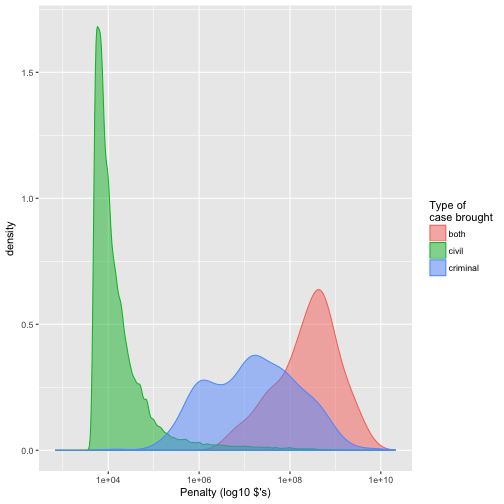
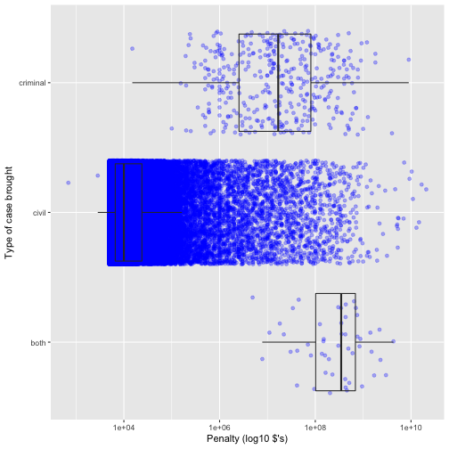
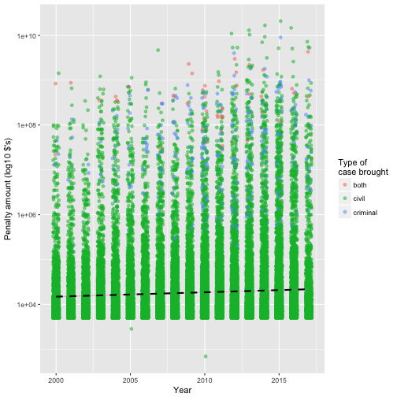
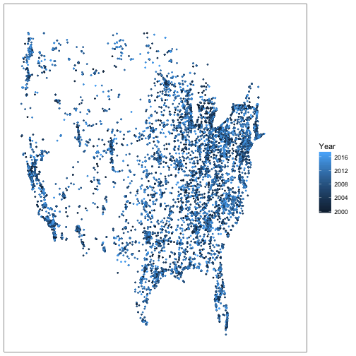
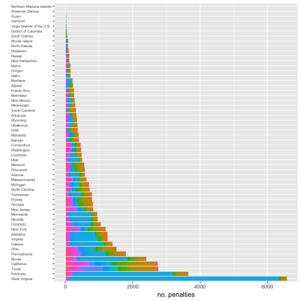
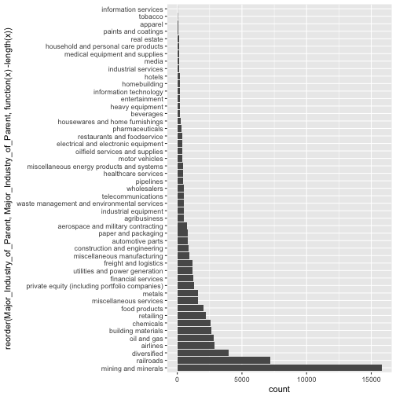
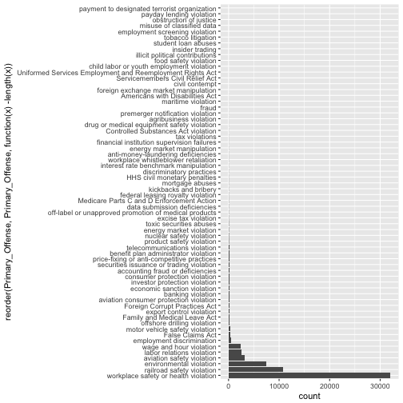
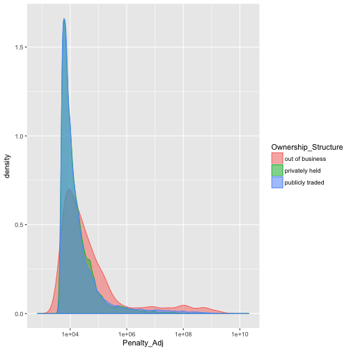
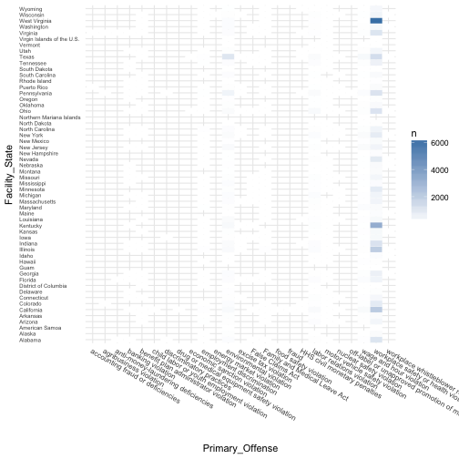

```r
require( tidyverse )
require( data.table )
require( maps )
require( zipcode )
require( lme4 )
```

This dataset covers the period of 2000--2017 and includes 62560 records of fines levied against corporations relating to violations of regulations, from cases initiated by 43 federal regulatory agencies. I downloaded the data from the Good Jobs First ["Violation Tracker"](https://www.goodjobsfirst.org/violation-tracker), using the search GUI with all the options set to `<any>`.


```r
viol <- tbl_df( fread( "/Users/willpitchers/Documents/=Job_Applications_etc/Data_Incubator_2017/violation_tracker_export.csv" ))

names( viol ) <- gsub( " ", "_", names( viol ))

viol <- viol %>% mutate( Year=as.integer( Year ), Industry_code=factor( Industry_in_Record ), Civ_Crim=factor( `Civil/Criminal` ) ) %>%
                  mutate( HQ_State_of_Parent=factor( HQ_State_of_Parent ), HQ_Country_of_Parent=factor( HQ_Country_of_Parent ) ) %>%
                  mutate( Primary_Offense=factor( Primary_Offense ), Penalty_Amount=as.numeric( gsub( "[$,]", "", Penalty_Amount ) ) ) %>% 
                  mutate( Penalty_Adj=as.numeric( gsub( "[$,]", "", Penalty_Amount_Adjusted_For_Eliminating_Multiple_Counting )) ) %>% 
                  mutate( Subtraction_From_Penalty=as.numeric( "[$,]", "", Subtraction_From_Penalty ) ) %>% 
                  mutate( Agency=factor( Agency ), Secondary_Offense=factor( Secondary_Offense ), Ownership_Structure=factor( Ownership_Structure ) ) %>% 
                  mutate( Major_Industry_of_Parent=factor( Major_Industry_of_Parent ), Zip=factor( Zip ), Facility_State=factor( Facility_State ) )
```

```
## Warning in evalq(as.numeric("[$,]", "", Subtraction_From_Penalty),
## <environment>): NAs introduced by coercion
```

```r
viol <- viol %>% mutate( Civ_Crim_bin=factor( ifelse( grepl( "civil and criminal", `Civil/Criminal` )=="TRUE", "both", 
                                              ifelse( grepl( "civil", `Civil/Criminal` )=="TRUE", "civil", "criminal" ))))

# str( viol )
# summary( viol$Year )
viol
```

```
## # A tibble: 62,560 x 28
##                                                               Company
##                                                                 <chr>
##  1                                                 1 800 PACK RAT LLC
##  2 1) Smithfield Foods, Inc. and  2) Smithfield Packing Company, Inc.
##  3                                             1366 TECHNOLOGIES INC.
##  4                                             1366 TECHNOLOGIES, INC
##  5                                                    180 Connect Inc
##  6                                                  180 Connect, Inc.
##  7                                             1st Financial Bank USA
##  8                                             1ST FINANCIAL BANK USA
##  9                           20TH CENTURY FOX STUDIOS (THREE STOOGES)
## 10                                           21ST CENTURY MEDIA, INC.
## # ... with 62,550 more rows, and 27 more variables: Parent_Company <chr>,
## #   Facility_State <fctr>, City <chr>, Address <chr>, Zip <fctr>,
## #   Description <chr>, Industry_in_Record <chr>, Year <int>,
## #   Record_Date <chr>, Penalty_Amount <dbl>,
## #   Subtraction_From_Penalty <dbl>,
## #   Penalty_Amount_Adjusted_For_Eliminating_Multiple_Counting <chr>,
## #   Agency <fctr>, Primary_Offense <fctr>, Secondary_Offense <fctr>,
## #   Source_of_Data <chr>, Notes <chr>, HQ_State_of_Parent <fctr>,
## #   HQ_Country_of_Parent <fctr>, Ownership_Structure <fctr>,
## #   Major_Industry_of_Parent <fctr>, `Civil/Criminal` <chr>,
## #   Prosecution_Agreement <chr>, Industry_code <fctr>, Civ_Crim <fctr>,
## #   Penalty_Adj <dbl>, Civ_Crim_bin <fctr>
```

## The Size of Penalties

This dataset contains fields for both `Penalty_Amount` and `Penalty_Amount_Adjusted_For_Eliminating_Multiple_Counting`, but is clear that these adjustments make very little difference to the data as a whole, as these two variables are correlation at r=0.994. I have thus elected to use the adjusted penalty values for all these analyses.

The first pattern to note is that (perhaps predictably) the penalties imposed via *criminal* proceedings tend to be larger than those imposed via *civil* proceedings, and larger still when both civil *and* criminal proceedings have been brought.


```r
viol %>% filter( Penalty_Adj > 0 ) %>% ggplot( aes( Penalty_Adj )) + 
          geom_density( aes( col=Civ_Crim_bin, fill=Civ_Crim_bin ), alpha=.5 ) + 
          scale_x_log10() + 
          xlab( "Penalty (log10 $'s)" ) + 
          scale_fill_discrete( name="Type of\ncase brought") + 
          scale_colour_discrete( name="Type of\ncase brought" )
```



The way this pattern is built up is somewhat non-intuitive, as this linear model and boxplot makes clear. The groups mean are well-separated, and easy to distinguish statistically (small p-values), but there is so much variation within groups that the predictive value of the mean differences is small (low R^2^ value). The vast majority of penalties arise from civil actions -- 99.3% of those recorded -- and the mean value of these penalties is comparatively small.


```r
summary( lm( Penalty_Adj ~ Civ_Crim_bin, data=viol ) )
```

```
## 
## Call:
## lm(formula = Penalty_Adj ~ Civ_Crim_bin, data = viol)
## 
## Residuals:
##        Min         1Q     Median         3Q        Max 
## -5.913e+08 -4.644e+06 -4.640e+06 -4.627e+06  2.080e+10 
## 
## Coefficients:
##                        Estimate Std. Error t value Pr(>|t|)    
## (Intercept)           596240136   24921654   23.93   <2e-16 ***
## Civ_Crim_bincivil    -591589764   24931682  -23.73   <2e-16 ***
## Civ_Crim_bincriminal -464209918   26451988  -17.55   <2e-16 ***
## ---
## Signif. codes:  0 '***' 0.001 '**' 0.01 '*' 0.05 '.' 0.1 ' ' 1
## 
## Residual standard error: 176200000 on 62557 degrees of freedom
## Multiple R-squared:  0.01211,	Adjusted R-squared:  0.01207 
## F-statistic: 383.3 on 2 and 62557 DF,  p-value: < 2.2e-16
```

```r
viol %>% filter( Penalty_Adj > 0 ) %>% ggplot( aes( Civ_Crim_bin, Penalty_Adj )) + 
                                        geom_point( colour="blue", alpha=0.3, position="jitter" ) + 
                                        geom_boxplot( outlier.size=0, alpha=0 ) + 
                                        coord_flip() + 
                                        xlab( "Type of case brought" ) +
                                        scale_y_log10() +
                                        ylab( "Penalty (log10 $'s)" )
```



## Trends over Time

Modelling the relationship between penalty values and the year the penalty was imposed reveals an increasing trend, with the coefficent for year indicating an increase of ~$950k per year. However, the R^2^ value for this model indicates that it accounts for only 0.05% of the variation in the data. 

This makes sense with reference to the scatter plot, where we can see that the trend for annual increase (represented by the dashed black line) is pretty modest when compared to *huge* variation in the size of penalties (note log^10^ scale).


```r
summary( lm( Penalty_Adj ~ Year, data=viol ) )
```

```
## 
## Call:
## lm(formula = Penalty_Adj ~ Year, data = viol)
## 
## Residuals:
##        Min         1Q     Median         3Q        Max 
## -1.323e+07 -9.358e+06 -6.516e+06 -2.701e+06  2.079e+10 
## 
## Coefficients:
##               Estimate Std. Error t value Pr(>|t|)    
## (Intercept) -1.915e+09  3.175e+08  -6.032 1.63e-09 ***
## Year         9.562e+05  1.580e+05   6.051 1.45e-09 ***
## ---
## Signif. codes:  0 '***' 0.001 '**' 0.01 '*' 0.05 '.' 0.1 ' ' 1
## 
## Residual standard error: 177200000 on 62558 degrees of freedom
## Multiple R-squared:  0.0005849,	Adjusted R-squared:  0.0005689 
## F-statistic: 36.61 on 1 and 62558 DF,  p-value: 1.449e-09
```

```r
viol %>% filter( Penalty_Adj > 0 ) %>% ggplot( aes( x=Year, y=Penalty_Adj ) ) + 
                                        geom_jitter( aes( col=Civ_Crim_bin ), alpha=0.5, width=.2, height=0 ) +
                                        ylab( "Penalty amount (log10 $'s)" ) +
                                        geom_smooth( method="lm", col="black", lty=2 ) + 
                                        scale_colour_discrete( name="Type of\ncase brought" ) +
                                        scale_y_log10()
```



## Where are Violations Occurring?

Taking a broad-strokes view of the geographical data, we can see that there seems not to be a visually apparent trend in the locations where penalties are levied -- this data appears to track pretty well with the locations of population centres, thought here may be more subtle patterns that are not visible at the nation-wide scale.


```r
data( zipcode )
zipcode <- zipcode %>% mutate( zip=factor( zip ), region=substr( zip, 1, 1) )

full_join( viol, zipcode, by=c( "Zip" = "zip" ) ) %>% mutate( Zip=factor( Zip ) ) %>% filter( Civ_Crim_bin=="civil" ) %>% 
    ggplot() + geom_point( aes( x=longitude, y=latitude, col=Year ), cex=.5 ) + 
        theme_bw() + scale_x_continuous(limits = c(-125,-66), breaks = NULL ) + 
        scale_y_continuous(limits = c(25,50), breaks = NULL ) + 
        labs(x=NULL, y=NULL)
```



However, if we look the number of penalties paid in each state/territory over the course of this 18-yr dataset, we can see that there are *many* more violations in some states that others, with West Virginia being responsible for 15.22% of all penalties levied. 


```r
viol %>% filter( Facility_State != "" ) %>% ggplot( aes( reorder( Facility_State, Facility_State, function(x)-length(x) ) )) + 
                                              geom_bar( aes( fill=Major_Industry_of_Parent )) + 
                                              coord_flip() +
                                              theme( axis.text.y=element_text( hjust=0, size=6 ) ) +
                                              ylab( "no. penalties" ) + 
                                              xlab( "" ) + 
                                              theme( legend.position="none" )
```



The bars are colored by the industrial sector of the parent corporation found liable for the penalty -- the blue that occupies 93.43% of the West Virginia bar represents corporations classified as "mining and minerals". It is apparent that WV is unusual in both the number of violations *and* the number of those violations related to mining.

## What are Corporations being Fined For?

Across the 49 industrial sectors represented, it is immediately clear from this barplot the extent to which mining & mineral corporations are over-represented (25.24% of all penalties). It is also clear that the pink areas -- indicating 'workplace safety or health' violations -- comprise the majority of violations in most sectors, but particularly so in mining.


```r
viol %>% filter( Facility_State != "" ) %>% ggplot( aes( reorder( Major_Industry_of_Parent, Major_Industry_of_Parent, function(x)-length(x) ) )) + 
                                              geom_bar( aes( fill=Primary_Offense )) + 
                                              coord_flip() +
                                              theme( axis.text.y=element_text( hjust=0, size=6 ) ) +
                                              ylab( "no. penalties" ) + 
                                              xlab( "" ) + 
                                              theme( legend.position="none" )
```


```r
viol %>% filter( Facility_State=="West Virginia" ) %>% ggplot( aes( reorder( Major_Industry_of_Parent, Major_Industry_of_Parent, function(x)-length(x)) )) + geom_bar() + coord_flip()
```


```r
summary( viol$Major_Industry_of_Parent )
```

```
##             aerospace and military contracting 
##                                            765 
##                                   agribusiness 
##                                            527 
##                                       airlines 
##                                           2898 
##                                        apparel 
##                                             52 
##                               automotive parts 
##                                            819 
##                                      beverages 
##                                            222 
##                             building materials 
##                                           2617 
##                                      chemicals 
##                                           2597 
##                   construction and engineering 
##                                            852 
##                                    diversified 
##                                           3984 
##            electrical and electronic equipment 
##                                            394 
##                                  entertainment 
##                                            196 
##                             financial services 
##                                           1222 
##                                  food products 
##                                           2037 
##                          freight and logistics 
##                                           1165 
##                            healthcare services 
##                                            436 
##                                heavy equipment 
##                                            198 
##                                   homebuilding 
##                                            184 
##                                         hotels 
##                                            176 
##           household and personal care products 
##                                            151 
##                housewares and home furnishings 
##                                            235 
##                           industrial equipment 
##                                            526 
##                            industrial services 
##                                            155 
##                           information services 
##                                              8 
##                         information technology 
##                                            187 
##                                          media 
##                                            152 
##                 medical equipment and supplies 
##                                            152 
##                                         metals 
##                                           1600 
##                            mining and minerals 
##                                          15791 
##      miscellaneous energy products and systems 
##                                            427 
##                    miscellaneous manufacturing 
##                                            952 
##                         miscellaneous services 
##                                           1615 
##                                 motor vehicles 
##                                            415 
##                                    oil and gas 
##                                           2801 
##                 oilfield services and supplies 
##                                            405 
##                            paints and coatings 
##                                             97 
##                            paper and packaging 
##                                            797 
##                                pharmaceuticals 
##                                            325 
##                                      pipelines 
##                                            466 
## private equity (including portfolio companies) 
##                                           1283 
##                                      railroads 
##                                           7181 
##                                    real estate 
##                                            114 
##                    restaurants and foodservice 
##                                            394 
##                                      retailing 
##                                           2238 
##                             telecommunications 
##                                            522 
##                                        tobacco 
##                                             26 
##                 utilities and power generation 
##                                           1182 
##    waste management and environmental services 
##                                            523 
##                                    wholesalers 
##                                            499
```

```r
viol %>% ggplot( aes( reorder( Major_Industry_of_Parent, Major_Industry_of_Parent, function(x)-length(x)) )) + geom_bar() + coord_flip()
```




```r
summary( viol$Primary_Offense )
```

```
##                          accounting fraud or deficiencies 
##                                                       137 
##                                    agribusiness violation 
##                                                        12 
##                           Americans with Disabilities Act 
##                                                         9 
##                        anti-money-laundering deficiencies 
##                                                        22 
##                    aviation consumer protection violation 
##                                                       183 
##                                 aviation safety violation 
##                                                      3125 
##                                         banking violation 
##                                                       179 
##                      benefit plan administrator violation 
##                                                       121 
##                 child labor or youth employment violation 
##                                                         3 
##                                            civil contempt 
##                                                         5 
##                             consumer protection violation 
##                                                       139 
##                       Controlled Substances Act violation 
##                                                        15 
##                              data submission deficiencies 
##                                                        36 
##                                  discriminatory practices 
##                                                        23 
##                drug or medical equipment safety violation 
##                                                        15 
##                               economic sanction violation 
##                                                       162 
##                                 employment discrimination 
##                                                       558 
##                            employment screening violation 
##                                                         1 
##                                energy market manipulation 
##                                                        20 
##                                   energy market violation 
##                                                        62 
##                                   environmental violation 
##                                                      7392 
##                                      excise tax violation 
##                                                        40 
##                                  export control violation 
##                                                       203 
##                                          False Claims Act 
##                                                       347 
##                              Family and Medical Leave Act 
##                                                       211 
##                         federal leasing royalty violation 
##                                                        30 
##                financial institution supervision failures 
##                                                        19 
##                                     food safety violation 
##                                                         3 
##                             Foreign Corrupt Practices Act 
##                                                       190 
##                      foreign exchange market manipulation 
##                                                         6 
##                                                     fraud 
##                                                        10 
##                              HHS civil monetary penalties 
##                                                        27 
##                           illicit political contributions 
##                                                         2 
##                                           insider trading 
##                                                         2 
##                      interest rate benchmark manipulation 
##                                                        23 
##                             investor protection violation 
##                                                       141 
##                                     kickbacks and bribery 
##                                                        29 
##                                 labor relations violation 
##                                                      2478 
##                                        maritime violation 
##                                                        10 
##                 Medicare Parts C and D Enforcement Action 
##                                                        34 
##                                 misuse of classified data 
##                                                         1 
##                                           mortgage abuses 
##                                                        28 
##                            motor vehicle safety violation 
##                                                       294 
##                                  nuclear safety violation 
##                                                        72 
##                                    obstruction of justice 
##                                                         1 
##     off-label or unapproved promotion of medical products 
##                                                        37 
##                               offshore drilling violation 
##                                                       233 
##                                  payday lending violation 
##                                                         1 
##              payment to designated terrorist organization 
##                                                         1 
##                          premerger notification violation 
##                                                        12 
##                price-fixing or anti-competitive practices 
##                                                       124 
##                                  product safety violation 
##                                                        79 
##                                 railroad safety violation 
##                                                     10823 
##                  securities issuance or trading violation 
##                                                       136 
##                           Servicemembers Civil Relief Act 
##                                                         4 
##                                       student loan abuses 
##                                                         2 
##                                            tax violations 
##                                                        19 
##                              telecommunications violation 
##                                                       111 
##                                        tobacco litigation 
##                                                         2 
##                                   toxic securities abuses 
##                                                        59 
## Uniformed Services Employment and Reemployment Rights Act 
##                                                         4 
##                                   wage and hour violation 
##                                                      2421 
##                      workplace safety or health violation 
##                                                     32049 
##                       workplace whistleblower retaliation 
##                                                        23
```

```r
viol %>% ggplot( aes( reorder( Primary_Offense, Primary_Offense, function(x)-length(x)) )) + geom_bar() + coord_flip()
```


 


```r
viol %>% filter( Penalty_Adj > 0 ) %>% ggplot( aes( Penalty_Adj )) + geom_density( aes( col=Ownership_Structure, fill=Ownership_Structure ), alpha=.5 ) + scale_x_log10()
```



```r
summary( lm( Penalty_Adj ~ Ownership_Structure, data=viol ) )
```

```
## 
## Call:
## lm(formula = Penalty_Adj ~ Ownership_Structure, data = viol)
## 
## Residuals:
##        Min         1Q     Median         3Q        Max 
## -2.397e+07 -7.226e+06 -7.218e+06 -6.423e+06  2.079e+10 
## 
## Coefficients:
##                                     Estimate Std. Error t value Pr(>|t|)  
## (Intercept)                         23974093   10234950   2.342   0.0192 *
## Ownership_Structureprivately held  -23300191   10350429  -2.251   0.0244 *
## Ownership_Structurepublicly traded -16740801   10266208  -1.631   0.1030  
## ---
## Signif. codes:  0 '***' 0.001 '**' 0.01 '*' 0.05 '.' 0.1 ' ' 1
## 
## Residual standard error: 177300000 on 62557 degrees of freedom
## Multiple R-squared:  0.0002778,	Adjusted R-squared:  0.0002458 
## F-statistic:  8.69 on 2 and 62557 DF,  p-value: 0.0001684
```


```r
viol %>% filter( Facility_State != "" ) %>% count( Primary_Offense, Facility_State ) %>% arrange( -n ) 
```

```
## # A tibble: 486 x 3
##                         Primary_Offense Facility_State     n
##                                  <fctr>         <fctr> <int>
##  1 workplace safety or health violation  West Virginia  6404
##  2 workplace safety or health violation       Kentucky  3321
##  3 workplace safety or health violation     California  2038
##  4 workplace safety or health violation       Illinois  1963
##  5 workplace safety or health violation          Texas  1304
##  6 workplace safety or health violation        Indiana  1106
##  7 workplace safety or health violation   Pennsylvania  1066
##  8 workplace safety or health violation           Ohio  1047
##  9 workplace safety or health violation        Alabama  1028
## 10 workplace safety or health violation       Virginia  1023
## # ... with 476 more rows
```

```r
viol %>% filter( Facility_State != "" ) %>% count( Facility_State, Major_Industry_of_Parent ) %>% arrange( -n ) 
```

```
## # A tibble: 1,866 x 3
##    Facility_State Major_Industry_of_Parent     n
##            <fctr>                   <fctr> <int>
##  1  West Virginia      mining and minerals  6139
##  2       Kentucky      mining and minerals  2824
##  3       Illinois      mining and minerals  1314
##  4        Indiana      mining and minerals   895
##  5       Virginia      mining and minerals   642
##  6         Nevada      mining and minerals   612
##  7        Alabama      mining and minerals   606
##  8          Texas              oil and gas   469
##  9      Minnesota                   metals   450
## 10   Pennsylvania      mining and minerals   392
## # ... with 1,856 more rows
```

```r
viol %>% filter( Facility_State != "" ) %>% count( Facility_State, Primary_Offense, Major_Industry_of_Parent ) %>% arrange( -n ) 
```

```
## # A tibble: 4,927 x 4
##    Facility_State                      Primary_Offense
##            <fctr>                               <fctr>
##  1  West Virginia workplace safety or health violation
##  2       Kentucky workplace safety or health violation
##  3       Illinois workplace safety or health violation
##  4        Indiana workplace safety or health violation
##  5       Virginia workplace safety or health violation
##  6         Nevada workplace safety or health violation
##  7        Alabama workplace safety or health violation
##  8      Minnesota workplace safety or health violation
##  9     California workplace safety or health violation
## 10   Pennsylvania workplace safety or health violation
## # ... with 4,917 more rows, and 2 more variables:
## #   Major_Industry_of_Parent <fctr>, n <int>
```

```r
viol %>% filter( Facility_State != "" ) %>% count( Primary_Offense, Facility_State ) %>% arrange( -n ) %>% 
        ggplot( aes( Primary_Offense, Facility_State ) ) + geom_tile( aes( fill=n ), col="white" ) + 
          scale_fill_gradient( low = "white", high = "steelblue" ) + theme_minimal() + 
            theme( axis.text.x = element_text( angle=330, hjust=0, size=8 ), axis.text.y=element_text( hjust=0, size=6 ) )
```



```r
viol %>% filter( Facility_State != "" ) %>% count( Major_Industry_of_Parent, Facility_State ) %>% arrange( -n ) 
```

```
## # A tibble: 1,866 x 3
##    Major_Industry_of_Parent Facility_State     n
##                      <fctr>         <fctr> <int>
##  1      mining and minerals  West Virginia  6139
##  2      mining and minerals       Kentucky  2824
##  3      mining and minerals       Illinois  1314
##  4      mining and minerals        Indiana   895
##  5      mining and minerals       Virginia   642
##  6      mining and minerals         Nevada   612
##  7      mining and minerals        Alabama   606
##  8              oil and gas          Texas   469
##  9                   metals      Minnesota   450
## 10      mining and minerals   Pennsylvania   392
## # ... with 1,856 more rows
```


```r
summary( lm( Penalty_Adj ~ Year  + Primary_Offense + Facility_State, data=viol ) )
```

```
## 
## Call:
## lm(formula = Penalty_Adj ~ Year + Primary_Offense + Facility_State, 
##     data = viol)
## 
## Residuals:
##        Min         1Q     Median         3Q        Max 
## -1.545e+09 -2.035e+06 -3.153e+05  1.387e+06  2.077e+10 
## 
## Coefficients:
##                                                                            Estimate
## (Intercept)                                                              -962997347
## Year                                                                         498428
## Primary_Offenseagribusiness violation                                     -32151269
## Primary_OffenseAmericans with Disabilities Act                            -37948328
## Primary_Offenseanti-money-laundering deficiencies                         208847040
## Primary_Offenseaviation consumer protection violation                     -37288976
## Primary_Offenseaviation safety violation                                  -35940734
## Primary_Offensebanking violation                                           76601551
## Primary_Offensebenefit plan administrator violation                       -11743688
## Primary_Offensechild labor or youth employment violation                  -27146675
## Primary_Offensecivil contempt                                             -35358337
## Primary_Offenseconsumer protection violation                               34052927
## Primary_OffenseControlled Substances Act violation                         -7508699
## Primary_Offensedata submission deficiencies                               -29742272
## Primary_Offensediscriminatory practices                                   -24178919
## Primary_Offensedrug or medical equipment safety violation                  85889275
## Primary_Offenseeconomic sanction violation                                 46605227
## Primary_Offenseemployment discrimination                                  -15625067
## Primary_Offenseemployment screening violation                             -37239218
## Primary_Offenseenergy market manipulation                                  51959099
## Primary_Offenseenergy market violation                                    -29206878
## Primary_Offenseenvironmental violation                                     -7587475
## Primary_Offenseexcise tax violation                                       -22211812
## Primary_Offenseexport control violation                                   -28935614
## Primary_OffenseFalse Claims Act                                            30525603
## Primary_OffenseFamily and Medical Leave Act                                -9594308
## Primary_Offensefederal leasing royalty violation                          -37123357
## Primary_Offensefinancial institution supervision failures                 -18371994
## Primary_Offensefood safety violation                                      -24757662
## Primary_OffenseForeign Corrupt Practices Act                                8767705
## Primary_Offenseforeign exchange market manipulation                       449416285
## Primary_Offensefraud                                                       79534834
## Primary_OffenseHHS civil monetary penalties                               -21245217
## Primary_Offenseillicit political contributions                            -28836073
## Primary_Offenseinsider trading                                            866629418
## Primary_Offenseinterest rate benchmark manipulation                       255081933
## Primary_Offenseinvestor protection violation                                4713329
## Primary_Offensekickbacks and bribery                                       24360326
## Primary_Offenselabor relations violation                                   -7178480
## Primary_Offensemaritime violation                                         -39504460
## Primary_OffenseMedicare Parts C and D Enforcement Action                  -40085334
## Primary_Offensemisuse of classified data                                   62652921
## Primary_Offensemortgage abuses                                           1505987343
## Primary_Offensemotor vehicle safety violation                              -4396257
## Primary_Offensenuclear safety violation                                   -25054158
## Primary_Offenseobstruction of justice                                     -34161513
## Primary_Offenseoff-label or unapproved promotion of medical products      448091214
## Primary_Offenseoffshore drilling violation                                -35879297
## Primary_Offensepayday lending violation                                   -21337646
## Primary_Offensepayment to designated terrorist organization               -12347079
## Primary_Offensepremerger notification violation                           -37019625
## Primary_Offenseprice-fixing or anti-competitive practices                  34557660
## Primary_Offenseproduct safety violation                                   -37337724
## Primary_Offenserailroad safety violation                                  -38296450
## Primary_Offensesecurities issuance or trading violation                    15361252
## Primary_OffenseServicemembers Civil Relief Act                            -34738769
## Primary_Offensestudent loan abuses                                         -9329501
## Primary_Offensetax violations                                             247849536
## Primary_Offensetelecommunications violation                               -29429496
## Primary_Offensetobacco litigation                                         -33090790
## Primary_Offensetoxic securities abuses                                   1438670067
## Primary_OffenseUniformed Services Employment and Reemployment Rights Act  -38161242
## Primary_Offensewage and hour violation                                     -8823824
## Primary_Offenseworkplace safety or health violation                        -9527307
## Primary_Offenseworkplace whistleblower retaliation                        -19487606
## Facility_StateAlabama                                                     -29398780
## Facility_StateAlaska                                                      -29522253
## Facility_StateAmerican Samoa                                              -30525813
## Facility_StateArizona                                                     -29499826
## Facility_StateArkansas                                                    -29347357
## Facility_StateCalifornia                                                  -29245233
## Facility_StateColorado                                                    -29022482
## Facility_StateConnecticut                                                 -28936124
## Facility_StateDelaware                                                    -32523479
## Facility_StateDistrict of Columbia                                        -29404403
## Facility_StateFlorida                                                     -30175905
## Facility_StateGeorgia                                                     -29964006
## Facility_StateGuam                                                        -28949629
## Facility_StateHawaii                                                      -29558192
## Facility_StateIdaho                                                       -27604735
## Facility_StateIllinois                                                    -29189770
## Facility_StateIndiana                                                     -29056275
## Facility_StateIowa                                                        -29492181
## Facility_StateKansas                                                      -29526275
## Facility_StateKentucky                                                    -29405165
## Facility_StateLouisiana                                                   -29035628
## Facility_StateMaine                                                       -29179619
## Facility_StateMaryland                                                    -28929933
## Facility_StateMassachusetts                                               -28485538
## Facility_StateMichigan                                                    -29399813
## Facility_StateMinnesota                                                   -30069281
## Facility_StateMississippi                                                 -30405744
## Facility_StateMissouri                                                    -29554829
## Facility_StateMontana                                                     -29882028
## Facility_StateNebraska                                                    -30610232
## Facility_StateNevada                                                      -29459732
## Facility_StateNew Hampshire                                               -29552496
## Facility_StateNew Jersey                                                  -29503930
## Facility_StateNew Mexico                                                  -29626486
## Facility_StateNew York                                                    -29324893
## Facility_StateNorth Carolina                                              -29580307
## Facility_StateNorth Dakota                                                -30483424
## Facility_StateNorthern Mariana Islands                                    -29000294
## Facility_StateOhio                                                        -28712422
## Facility_StateOklahoma                                                    -29761559
## Facility_StateOregon                                                      -30398387
## Facility_StatePennsylvania                                                -29900866
## Facility_StatePuerto Rico                                                 -31495675
## Facility_StateRhode Island                                                -32483193
## Facility_StateSouth Carolina                                              -29664712
## Facility_StateSouth Dakota                                                -37753932
## Facility_StateTennessee                                                   -29847988
## Facility_StateTexas                                                       -29637875
## Facility_StateUtah                                                        -29580738
## Facility_StateVermont                                                     -29910786
## Facility_StateVirgin Islands of the U.S.                                    2919484
## Facility_StateVirginia                                                    -29212869
## Facility_StateWashington                                                  -29984886
## Facility_StateWest Virginia                                               -29697284
## Facility_StateWisconsin                                                   -25882540
## Facility_StateWyoming                                                     -29654855
##                                                                          Std. Error
## (Intercept)                                                               321951961
## Year                                                                         160044
## Primary_Offenseagribusiness violation                                      50342930
## Primary_OffenseAmericans with Disabilities Act                             57530925
## Primary_Offenseanti-money-laundering deficiencies                          38404130
## Primary_Offenseaviation consumer protection violation                      18888468
## Primary_Offenseaviation safety violation                                   14619340
## Primary_Offensebanking violation                                           19151657
## Primary_Offensebenefit plan administrator violation                        21149951
## Primary_Offensechild labor or youth employment violation                   97587818
## Primary_Offensecivil contempt                                              76120173
## Primary_Offenseconsumer protection violation                               20130113
## Primary_OffenseControlled Substances Act violation                         45471284
## Primary_Offensedata submission deficiencies                                31312211
## Primary_Offensediscriminatory practices                                    37680841
## Primary_Offensedrug or medical equipment safety violation                  45472421
## Primary_Offenseeconomic sanction violation                                 19412119
## Primary_Offenseemployment discrimination                                   16208603
## Primary_Offenseemployment screening violation                             167791020
## Primary_Offenseenergy market manipulation                                  40020791
## Primary_Offenseenergy market violation                                     25590331
## Primary_Offenseenvironmental violation                                     14634463
## Primary_Offenseexcise tax violation                                        30123922
## Primary_Offenseexport control violation                                    18489331
## Primary_OffenseFalse Claims Act                                            16870573
## Primary_OffenseFamily and Medical Leave Act                                18738938
## Primary_Offensefederal leasing royalty violation                           33700135
## Primary_Offensefinancial institution supervision failures                  40928070
## Primary_Offensefood safety violation                                       97589424
## Primary_OffenseForeign Corrupt Practices Act                               18740947
## Primary_Offenseforeign exchange market manipulation                        69736567
## Primary_Offensefraud                                                       54765960
## Primary_OffenseHHS civil monetary penalties                                35272060
## Primary_Offenseillicit political contributions                            119077059
## Primary_Offenseinsider trading                                            119075053
## Primary_Offenseinterest rate benchmark manipulation                        37680459
## Primary_Offenseinvestor protection violation                               20057014
## Primary_Offensekickbacks and bribery                                       34173840
## Primary_Offenselabor relations violation                                   15165763
## Primary_Offensemaritime violation                                          54765494
## Primary_OffenseMedicare Parts C and D Enforcement Action                   32038452
## Primary_Offensemisuse of classified data                                  167791148
## Primary_Offensemortgage abuses                                             34675180
## Primary_Offensemotor vehicle safety violation                              17609273
## Primary_Offensenuclear safety violation                                    24390307
## Primary_Offenseobstruction of justice                                     167796340
## Primary_Offenseoff-label or unapproved promotion of medical products       30975224
## Primary_Offenseoffshore drilling violation                                 18021571
## Primary_Offensepayday lending violation                                   167791452
## Primary_Offensepayment to designated terrorist organization               167791148
## Primary_Offensepremerger notification violation                            50330721
## Primary_Offenseprice-fixing or anti-competitive practices                  20723080
## Primary_Offenseproduct safety violation                                    23618591
## Primary_Offenserailroad safety violation                                   14374993
## Primary_Offensesecurities issuance or trading violation                    20237491
## Primary_OffenseServicemembers Civil Relief Act                             84806344
## Primary_Offensestudent loan abuses                                        119078098
## Primary_Offensetax violations                                              40931639
## Primary_Offensetelecommunications violation                                21351300
## Primary_Offensetobacco litigation                                         119075232
## Primary_Offensetoxic securities abuses                                     26041527
## Primary_OffenseUniformed Services Employment and Reemployment Rights Act   84802512
## Primary_Offensewage and hour violation                                     15157936
## Primary_Offenseworkplace safety or health violation                        14814962
## Primary_Offenseworkplace whistleblower retaliation                         37798376
## Facility_StateAlabama                                                       6108789
## Facility_StateAlaska                                                       11868472
## Facility_StateAmerican Samoa                                              118264540
## Facility_StateArizona                                                       7973817
## Facility_StateArkansas                                                     10003992
## Facility_StateCalifornia                                                    4985368
## Facility_StateColorado                                                      6421623
## Facility_StateConnecticut                                                   8811863
## Facility_StateDelaware                                                     17100402
## Facility_StateDistrict of Columbia                                         29787890
## Facility_StateFlorida                                                       7085692
## Facility_StateGeorgia                                                       6984338
## Facility_StateGuam                                                         46539424
## Facility_StateHawaii                                                       16458827
## Facility_StateIdaho                                                        14169852
## Facility_StateIllinois                                                      5143100
## Facility_StateIndiana                                                       5889955
## Facility_StateIowa                                                          9624099
## Facility_StateKansas                                                        9220641
## Facility_StateKentucky                                                      4789649
## Facility_StateLouisiana                                                     8455005
## Facility_StateMaine                                                        14658156
## Facility_StateMaryland                                                      9386738
## Facility_StateMassachusetts                                                 7738039
## Facility_StateMichigan                                                      7351285
## Facility_StateMinnesota                                                     6675724
## Facility_StateMississippi                                                  10474533
## Facility_StateMissouri                                                      8055078
## Facility_StateMontana                                                      12339140
## Facility_StateNebraska                                                     11039512
## Facility_StateNevada                                                        6695230
## Facility_StateNew Hampshire                                                16230370
## Facility_StateNew Jersey                                                    6896730
## Facility_StateNew Mexico                                                   10905488
## Facility_StateNew York                                                      6138814
## Facility_StateNorth Carolina                                                7311718
## Facility_StateNorth Dakota                                                 19650853
## Facility_StateNorthern Mariana Islands                                    167260304
## Facility_StateOhio                                                          5745094
## Facility_StateOklahoma                                                      9648358
## Facility_StateOregon                                                       14360485
## Facility_StatePennsylvania                                                  5351291
## Facility_StatePuerto Rico                                                  11250657
## Facility_StateRhode Island                                                 20059028
## Facility_StateSouth Carolina                                               10210818
## Facility_StateSouth Dakota                                                 25276497
## Facility_StateTennessee                                                     7077181
## Facility_StateTexas                                                         4738768
## Facility_StateUtah                                                          8437427
## Facility_StateVermont                                                      43342085
## Facility_StateVirgin Islands of the U.S.                                   36656545
## Facility_StateVirginia                                                      6090932
## Facility_StateWashington                                                    8608648
## Facility_StateWest Virginia                                                 4482509
## Facility_StateWisconsin                                                     7987966
## Facility_StateWyoming                                                       9934866
##                                                                          t value
## (Intercept)                                                               -2.991
## Year                                                                       3.114
## Primary_Offenseagribusiness violation                                     -0.639
## Primary_OffenseAmericans with Disabilities Act                            -0.660
## Primary_Offenseanti-money-laundering deficiencies                          5.438
## Primary_Offenseaviation consumer protection violation                     -1.974
## Primary_Offenseaviation safety violation                                  -2.458
## Primary_Offensebanking violation                                           4.000
## Primary_Offensebenefit plan administrator violation                       -0.555
## Primary_Offensechild labor or youth employment violation                  -0.278
## Primary_Offensecivil contempt                                             -0.465
## Primary_Offenseconsumer protection violation                               1.692
## Primary_OffenseControlled Substances Act violation                        -0.165
## Primary_Offensedata submission deficiencies                               -0.950
## Primary_Offensediscriminatory practices                                   -0.642
## Primary_Offensedrug or medical equipment safety violation                  1.889
## Primary_Offenseeconomic sanction violation                                 2.401
## Primary_Offenseemployment discrimination                                  -0.964
## Primary_Offenseemployment screening violation                             -0.222
## Primary_Offenseenergy market manipulation                                  1.298
## Primary_Offenseenergy market violation                                    -1.141
## Primary_Offenseenvironmental violation                                    -0.518
## Primary_Offenseexcise tax violation                                       -0.737
## Primary_Offenseexport control violation                                   -1.565
## Primary_OffenseFalse Claims Act                                            1.809
## Primary_OffenseFamily and Medical Leave Act                               -0.512
## Primary_Offensefederal leasing royalty violation                          -1.102
## Primary_Offensefinancial institution supervision failures                 -0.449
## Primary_Offensefood safety violation                                      -0.254
## Primary_OffenseForeign Corrupt Practices Act                               0.468
## Primary_Offenseforeign exchange market manipulation                        6.444
## Primary_Offensefraud                                                       1.452
## Primary_OffenseHHS civil monetary penalties                               -0.602
## Primary_Offenseillicit political contributions                            -0.242
## Primary_Offenseinsider trading                                             7.278
## Primary_Offenseinterest rate benchmark manipulation                        6.770
## Primary_Offenseinvestor protection violation                               0.235
## Primary_Offensekickbacks and bribery                                       0.713
## Primary_Offenselabor relations violation                                  -0.473
## Primary_Offensemaritime violation                                         -0.721
## Primary_OffenseMedicare Parts C and D Enforcement Action                  -1.251
## Primary_Offensemisuse of classified data                                   0.373
## Primary_Offensemortgage abuses                                            43.431
## Primary_Offensemotor vehicle safety violation                             -0.250
## Primary_Offensenuclear safety violation                                   -1.027
## Primary_Offenseobstruction of justice                                     -0.204
## Primary_Offenseoff-label or unapproved promotion of medical products      14.466
## Primary_Offenseoffshore drilling violation                                -1.991
## Primary_Offensepayday lending violation                                   -0.127
## Primary_Offensepayment to designated terrorist organization               -0.074
## Primary_Offensepremerger notification violation                           -0.736
## Primary_Offenseprice-fixing or anti-competitive practices                  1.668
## Primary_Offenseproduct safety violation                                   -1.581
## Primary_Offenserailroad safety violation                                  -2.664
## Primary_Offensesecurities issuance or trading violation                    0.759
## Primary_OffenseServicemembers Civil Relief Act                            -0.410
## Primary_Offensestudent loan abuses                                        -0.078
## Primary_Offensetax violations                                              6.055
## Primary_Offensetelecommunications violation                               -1.378
## Primary_Offensetobacco litigation                                         -0.278
## Primary_Offensetoxic securities abuses                                    55.245
## Primary_OffenseUniformed Services Employment and Reemployment Rights Act  -0.450
## Primary_Offensewage and hour violation                                    -0.582
## Primary_Offenseworkplace safety or health violation                       -0.643
## Primary_Offenseworkplace whistleblower retaliation                        -0.516
## Facility_StateAlabama                                                     -4.813
## Facility_StateAlaska                                                      -2.487
## Facility_StateAmerican Samoa                                              -0.258
## Facility_StateArizona                                                     -3.700
## Facility_StateArkansas                                                    -2.934
## Facility_StateCalifornia                                                  -5.866
## Facility_StateColorado                                                    -4.519
## Facility_StateConnecticut                                                 -3.284
## Facility_StateDelaware                                                    -1.902
## Facility_StateDistrict of Columbia                                        -0.987
## Facility_StateFlorida                                                     -4.259
## Facility_StateGeorgia                                                     -4.290
## Facility_StateGuam                                                        -0.622
## Facility_StateHawaii                                                      -1.796
## Facility_StateIdaho                                                       -1.948
## Facility_StateIllinois                                                    -5.676
## Facility_StateIndiana                                                     -4.933
## Facility_StateIowa                                                        -3.064
## Facility_StateKansas                                                      -3.202
## Facility_StateKentucky                                                    -6.139
## Facility_StateLouisiana                                                   -3.434
## Facility_StateMaine                                                       -1.991
## Facility_StateMaryland                                                    -3.082
## Facility_StateMassachusetts                                               -3.681
## Facility_StateMichigan                                                    -3.999
## Facility_StateMinnesota                                                   -4.504
## Facility_StateMississippi                                                 -2.903
## Facility_StateMissouri                                                    -3.669
## Facility_StateMontana                                                     -2.422
## Facility_StateNebraska                                                    -2.773
## Facility_StateNevada                                                      -4.400
## Facility_StateNew Hampshire                                               -1.821
## Facility_StateNew Jersey                                                  -4.278
## Facility_StateNew Mexico                                                  -2.717
## Facility_StateNew York                                                    -4.777
## Facility_StateNorth Carolina                                              -4.046
## Facility_StateNorth Dakota                                                -1.551
## Facility_StateNorthern Mariana Islands                                    -0.173
## Facility_StateOhio                                                        -4.998
## Facility_StateOklahoma                                                    -3.085
## Facility_StateOregon                                                      -2.117
## Facility_StatePennsylvania                                                -5.588
## Facility_StatePuerto Rico                                                 -2.799
## Facility_StateRhode Island                                                -1.619
## Facility_StateSouth Carolina                                              -2.905
## Facility_StateSouth Dakota                                                -1.494
## Facility_StateTennessee                                                   -4.217
## Facility_StateTexas                                                       -6.254
## Facility_StateUtah                                                        -3.506
## Facility_StateVermont                                                     -0.690
## Facility_StateVirgin Islands of the U.S.                                   0.080
## Facility_StateVirginia                                                    -4.796
## Facility_StateWashington                                                  -3.483
## Facility_StateWest Virginia                                               -6.625
## Facility_StateWisconsin                                                   -3.240
## Facility_StateWyoming                                                     -2.985
##                                                                          Pr(>|t|)
## (Intercept)                                                              0.002781
## Year                                                                     0.001845
## Primary_Offenseagribusiness violation                                    0.523056
## Primary_OffenseAmericans with Disabilities Act                           0.509503
## Primary_Offenseanti-money-laundering deficiencies                        5.40e-08
## Primary_Offenseaviation consumer protection violation                    0.048367
## Primary_Offenseaviation safety violation                                 0.013957
## Primary_Offensebanking violation                                         6.35e-05
## Primary_Offensebenefit plan administrator violation                      0.578720
## Primary_Offensechild labor or youth employment violation                 0.780877
## Primary_Offensecivil contempt                                            0.642286
## Primary_Offenseconsumer protection violation                             0.090719
## Primary_OffenseControlled Substances Act violation                       0.868842
## Primary_Offensedata submission deficiencies                              0.342186
## Primary_Offensediscriminatory practices                                  0.521085
## Primary_Offensedrug or medical equipment safety violation                0.058920
## Primary_Offenseeconomic sanction violation                               0.016361
## Primary_Offenseemployment discrimination                                 0.335050
## Primary_Offenseemployment screening violation                            0.824363
## Primary_Offenseenergy market manipulation                                0.194188
## Primary_Offenseenergy market violation                                   0.253739
## Primary_Offenseenvironmental violation                                   0.604135
## Primary_Offenseexcise tax violation                                      0.460914
## Primary_Offenseexport control violation                                  0.117590
## Primary_OffenseFalse Claims Act                                          0.070394
## Primary_OffenseFamily and Medical Leave Act                              0.608654
## Primary_Offensefederal leasing royalty violation                         0.270649
## Primary_Offensefinancial institution supervision failures                0.653516
## Primary_Offensefood safety violation                                     0.799734
## Primary_OffenseForeign Corrupt Practices Act                             0.639903
## Primary_Offenseforeign exchange market manipulation                      1.17e-10
## Primary_Offensefraud                                                     0.146432
## Primary_OffenseHHS civil monetary penalties                              0.546961
## Primary_Offenseillicit political contributions                           0.808655
## Primary_Offenseinsider trading                                           3.43e-13
## Primary_Offenseinterest rate benchmark manipulation                      1.30e-11
## Primary_Offenseinvestor protection violation                             0.814212
## Primary_Offensekickbacks and bribery                                     0.475950
## Primary_Offenselabor relations violation                                 0.635976
## Primary_Offensemaritime violation                                        0.470704
## Primary_OffenseMedicare Parts C and D Enforcement Action                 0.210880
## Primary_Offensemisuse of classified data                                 0.708853
## Primary_Offensemortgage abuses                                            < 2e-16
## Primary_Offensemotor vehicle safety violation                            0.802854
## Primary_Offensenuclear safety violation                                  0.304322
## Primary_Offenseobstruction of justice                                    0.838675
## Primary_Offenseoff-label or unapproved promotion of medical products      < 2e-16
## Primary_Offenseoffshore drilling violation                               0.046495
## Primary_Offensepayday lending violation                                  0.898808
## Primary_Offensepayment to designated terrorist organization              0.941340
## Primary_Offensepremerger notification violation                          0.462021
## Primary_Offenseprice-fixing or anti-competitive practices                0.095402
## Primary_Offenseproduct safety violation                                  0.113915
## Primary_Offenserailroad safety violation                                 0.007721
## Primary_Offensesecurities issuance or trading violation                  0.447826
## Primary_OffenseServicemembers Civil Relief Act                           0.682083
## Primary_Offensestudent loan abuses                                       0.937552
## Primary_Offensetax violations                                            1.41e-09
## Primary_Offensetelecommunications violation                              0.168101
## Primary_Offensetobacco litigation                                        0.781091
## Primary_Offensetoxic securities abuses                                    < 2e-16
## Primary_OffenseUniformed Services Employment and Reemployment Rights Act 0.652711
## Primary_Offensewage and hour violation                                   0.560484
## Primary_Offenseworkplace safety or health violation                      0.520170
## Primary_Offenseworkplace whistleblower retaliation                       0.606158
## Facility_StateAlabama                                                    1.49e-06
## Facility_StateAlaska                                                     0.012869
## Facility_StateAmerican Samoa                                             0.796319
## Facility_StateArizona                                                    0.000216
## Facility_StateArkansas                                                   0.003352
## Facility_StateCalifornia                                                 4.48e-09
## Facility_StateColorado                                                   6.21e-06
## Facility_StateConnecticut                                                0.001025
## Facility_StateDelaware                                                   0.057187
## Facility_StateDistrict of Columbia                                       0.323585
## Facility_StateFlorida                                                    2.06e-05
## Facility_StateGeorgia                                                    1.79e-05
## Facility_StateGuam                                                       0.533914
## Facility_StateHawaii                                                     0.072517
## Facility_StateIdaho                                                      0.051404
## Facility_StateIllinois                                                   1.39e-08
## Facility_StateIndiana                                                    8.11e-07
## Facility_StateIowa                                                       0.002182
## Facility_StateKansas                                                     0.001365
## Facility_StateKentucky                                                   8.34e-10
## Facility_StateLouisiana                                                  0.000595
## Facility_StateMaine                                                      0.046521
## Facility_StateMaryland                                                   0.002057
## Facility_StateMassachusetts                                              0.000232
## Facility_StateMichigan                                                   6.36e-05
## Facility_StateMinnesota                                                  6.67e-06
## Facility_StateMississippi                                                0.003699
## Facility_StateMissouri                                                   0.000244
## Facility_StateMontana                                                    0.015450
## Facility_StateNebraska                                                   0.005559
## Facility_StateNevada                                                     1.08e-05
## Facility_StateNew Hampshire                                              0.068640
## Facility_StateNew Jersey                                                 1.89e-05
## Facility_StateNew Mexico                                                 0.006596
## Facility_StateNew York                                                   1.78e-06
## Facility_StateNorth Carolina                                             5.23e-05
## Facility_StateNorth Dakota                                               0.120846
## Facility_StateNorthern Mariana Islands                                   0.862350
## Facility_StateOhio                                                       5.82e-07
## Facility_StateOklahoma                                                   0.002039
## Facility_StateOregon                                                     0.034280
## Facility_StatePennsylvania                                               2.31e-08
## Facility_StatePuerto Rico                                                0.005121
## Facility_StateRhode Island                                               0.105371
## Facility_StateSouth Carolina                                             0.003671
## Facility_StateSouth Dakota                                               0.135275
## Facility_StateTennessee                                                  2.47e-05
## Facility_StateTexas                                                      4.02e-10
## Facility_StateUtah                                                       0.000455
## Facility_StateVermont                                                    0.490128
## Facility_StateVirgin Islands of the U.S.                                 0.936520
## Facility_StateVirginia                                                   1.62e-06
## Facility_StateWashington                                                 0.000496
## Facility_StateWest Virginia                                              3.50e-11
## Facility_StateWisconsin                                                  0.001195
## Facility_StateWyoming                                                    0.002838
##                                                                             
## (Intercept)                                                              ** 
## Year                                                                     ** 
## Primary_Offenseagribusiness violation                                       
## Primary_OffenseAmericans with Disabilities Act                              
## Primary_Offenseanti-money-laundering deficiencies                        ***
## Primary_Offenseaviation consumer protection violation                    *  
## Primary_Offenseaviation safety violation                                 *  
## Primary_Offensebanking violation                                         ***
## Primary_Offensebenefit plan administrator violation                         
## Primary_Offensechild labor or youth employment violation                    
## Primary_Offensecivil contempt                                               
## Primary_Offenseconsumer protection violation                             .  
## Primary_OffenseControlled Substances Act violation                          
## Primary_Offensedata submission deficiencies                                 
## Primary_Offensediscriminatory practices                                     
## Primary_Offensedrug or medical equipment safety violation                .  
## Primary_Offenseeconomic sanction violation                               *  
## Primary_Offenseemployment discrimination                                    
## Primary_Offenseemployment screening violation                               
## Primary_Offenseenergy market manipulation                                   
## Primary_Offenseenergy market violation                                      
## Primary_Offenseenvironmental violation                                      
## Primary_Offenseexcise tax violation                                         
## Primary_Offenseexport control violation                                     
## Primary_OffenseFalse Claims Act                                          .  
## Primary_OffenseFamily and Medical Leave Act                                 
## Primary_Offensefederal leasing royalty violation                            
## Primary_Offensefinancial institution supervision failures                   
## Primary_Offensefood safety violation                                        
## Primary_OffenseForeign Corrupt Practices Act                                
## Primary_Offenseforeign exchange market manipulation                      ***
## Primary_Offensefraud                                                        
## Primary_OffenseHHS civil monetary penalties                                 
## Primary_Offenseillicit political contributions                              
## Primary_Offenseinsider trading                                           ***
## Primary_Offenseinterest rate benchmark manipulation                      ***
## Primary_Offenseinvestor protection violation                                
## Primary_Offensekickbacks and bribery                                        
## Primary_Offenselabor relations violation                                    
## Primary_Offensemaritime violation                                           
## Primary_OffenseMedicare Parts C and D Enforcement Action                    
## Primary_Offensemisuse of classified data                                    
## Primary_Offensemortgage abuses                                           ***
## Primary_Offensemotor vehicle safety violation                               
## Primary_Offensenuclear safety violation                                     
## Primary_Offenseobstruction of justice                                       
## Primary_Offenseoff-label or unapproved promotion of medical products     ***
## Primary_Offenseoffshore drilling violation                               *  
## Primary_Offensepayday lending violation                                     
## Primary_Offensepayment to designated terrorist organization                 
## Primary_Offensepremerger notification violation                             
## Primary_Offenseprice-fixing or anti-competitive practices                .  
## Primary_Offenseproduct safety violation                                     
## Primary_Offenserailroad safety violation                                 ** 
## Primary_Offensesecurities issuance or trading violation                     
## Primary_OffenseServicemembers Civil Relief Act                              
## Primary_Offensestudent loan abuses                                          
## Primary_Offensetax violations                                            ***
## Primary_Offensetelecommunications violation                                 
## Primary_Offensetobacco litigation                                           
## Primary_Offensetoxic securities abuses                                   ***
## Primary_OffenseUniformed Services Employment and Reemployment Rights Act    
## Primary_Offensewage and hour violation                                      
## Primary_Offenseworkplace safety or health violation                         
## Primary_Offenseworkplace whistleblower retaliation                          
## Facility_StateAlabama                                                    ***
## Facility_StateAlaska                                                     *  
## Facility_StateAmerican Samoa                                                
## Facility_StateArizona                                                    ***
## Facility_StateArkansas                                                   ** 
## Facility_StateCalifornia                                                 ***
## Facility_StateColorado                                                   ***
## Facility_StateConnecticut                                                ** 
## Facility_StateDelaware                                                   .  
## Facility_StateDistrict of Columbia                                          
## Facility_StateFlorida                                                    ***
## Facility_StateGeorgia                                                    ***
## Facility_StateGuam                                                          
## Facility_StateHawaii                                                     .  
## Facility_StateIdaho                                                      .  
## Facility_StateIllinois                                                   ***
## Facility_StateIndiana                                                    ***
## Facility_StateIowa                                                       ** 
## Facility_StateKansas                                                     ** 
## Facility_StateKentucky                                                   ***
## Facility_StateLouisiana                                                  ***
## Facility_StateMaine                                                      *  
## Facility_StateMaryland                                                   ** 
## Facility_StateMassachusetts                                              ***
## Facility_StateMichigan                                                   ***
## Facility_StateMinnesota                                                  ***
## Facility_StateMississippi                                                ** 
## Facility_StateMissouri                                                   ***
## Facility_StateMontana                                                    *  
## Facility_StateNebraska                                                   ** 
## Facility_StateNevada                                                     ***
## Facility_StateNew Hampshire                                              .  
## Facility_StateNew Jersey                                                 ***
## Facility_StateNew Mexico                                                 ** 
## Facility_StateNew York                                                   ***
## Facility_StateNorth Carolina                                             ***
## Facility_StateNorth Dakota                                                  
## Facility_StateNorthern Mariana Islands                                      
## Facility_StateOhio                                                       ***
## Facility_StateOklahoma                                                   ** 
## Facility_StateOregon                                                     *  
## Facility_StatePennsylvania                                               ***
## Facility_StatePuerto Rico                                                ** 
## Facility_StateRhode Island                                                  
## Facility_StateSouth Carolina                                             ** 
## Facility_StateSouth Dakota                                                  
## Facility_StateTennessee                                                  ***
## Facility_StateTexas                                                      ***
## Facility_StateUtah                                                       ***
## Facility_StateVermont                                                       
## Facility_StateVirgin Islands of the U.S.                                    
## Facility_StateVirginia                                                   ***
## Facility_StateWashington                                                 ***
## Facility_StateWest Virginia                                              ***
## Facility_StateWisconsin                                                  ** 
## Facility_StateWyoming                                                    ** 
## ---
## Signif. codes:  0 '***' 0.001 '**' 0.01 '*' 0.05 '.' 0.1 ' ' 1
## 
## Residual standard error: 167200000 on 62439 degrees of freedom
## Multiple R-squared:  0.1126,	Adjusted R-squared:  0.1108 
## F-statistic: 65.99 on 120 and 62439 DF,  p-value: < 2.2e-16
```


```r
summary( lm( Penalty_Adj ~ Year, data=viol[ viol$Civ_Crim_bin=="civil", ] ) )
```

```
## 
## Call:
## lm(formula = Penalty_Adj ~ Year, data = viol[viol$Civ_Crim_bin == 
##     "civil", ])
## 
## Residuals:
##        Min         1Q     Median         3Q        Max 
## -1.069e+07 -7.487e+06 -5.143e+06 -1.996e+06  2.079e+10 
## 
## Coefficients:
##               Estimate Std. Error t value Pr(>|t|)    
## (Intercept) -1.581e+09  3.056e+08  -5.174 2.30e-07 ***
## Year         7.891e+05  1.521e+05   5.189 2.12e-07 ***
## ---
## Signif. codes:  0 '***' 0.001 '**' 0.01 '*' 0.05 '.' 0.1 ' ' 1
## 
## Residual standard error: 1.7e+08 on 62113 degrees of freedom
## Multiple R-squared:  0.0004333,	Adjusted R-squared:  0.0004172 
## F-statistic: 26.93 on 1 and 62113 DF,  p-value: 2.12e-07
```

```r
summary( lmer( Penalty_Adj ~ Year + Civ_Crim_bin + ( Year | Facility_State ), data=viol ) )
```

```
## Warning in checkConv(attr(opt, "derivs"), opt$par, ctrl = control
## $checkConv, : Model failed to converge with max|grad| = 3.92556 (tol =
## 0.002, component 1)
```

```
## Warning in checkConv(attr(opt, "derivs"), opt$par, ctrl = control$checkConv, : Model is nearly unidentifiable: very large eigenvalue
##  - Rescale variables?
```

```
## Linear mixed model fit by REML ['lmerMod']
## Formula: Penalty_Adj ~ Year + Civ_Crim_bin + (Year | Facility_State)
##    Data: viol
## 
## REML criterion at convergence: 2552961
## 
## Scaled residuals: 
##     Min      1Q  Median      3Q     Max 
##  -3.393  -0.039  -0.014   0.004 118.038 
## 
## Random effects:
##  Groups         Name        Variance  Std.Dev.  Corr 
##  Facility_State (Intercept) 4.478e+16 211603727      
##                 Year        1.143e+10    106909 -1.00
##  Residual                   3.098e+16 176015838      
## Number of obs: 62560, groups:  Facility_State, 57
## 
## Fixed effects:
##                        Estimate Std. Error t value
## (Intercept)          -1.312e+09  3.207e+08  -4.091
## Year                  9.421e+05  1.591e+05   5.923
## Civ_Crim_bincivil    -5.802e+08  2.492e+07 -23.281
## Civ_Crim_bincriminal -4.629e+08  2.642e+07 -17.520
## 
## Correlation of Fixed Effects:
##             (Intr) Year   Cv_Crm_bncv
## Year        -0.997                   
## Cv_Crm_bncv -0.086  0.008            
## Cv_Crm_bncr -0.070 -0.003  0.941     
## convergence code: 0
## Model failed to converge with max|grad| = 3.92556 (tol = 0.002, component 1)
## Model is nearly unidentifiable: very large eigenvalue
##  - Rescale variables?
```
