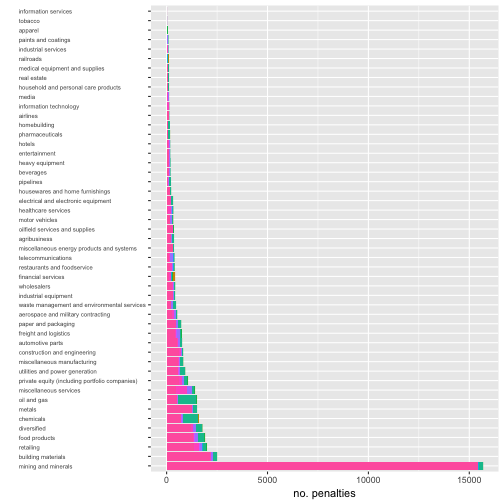
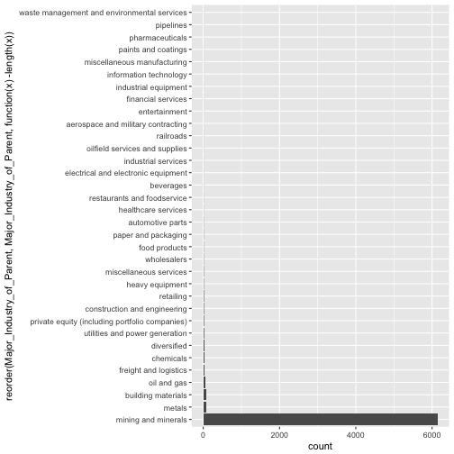

```r
setwd( "/Users/willpitchers/Documents/=Job_Applications_etc/Data_Incubator_2017" )

require( tidyverse )
require( data.table )
```


data from `https://www.goodjobsfirst.org/violation-tracker`


```r
viol <- tbl_df( fread( "violoation_tracker_export.csv" ))

names( viol ) <- gsub( " ", "_", names( viol ))

viol <- viol %>% mutate( Year=as.integer( Year ), Industry_code=factor( Industry_in_Record ), Civ_Crim=factor( `Civil/Criminal` ) ) %>%
                  mutate( HQ_State_of_Parent=factor( HQ_State_of_Parent ), HQ_Country_of_Parent=factor( HQ_Country_of_Parent ) ) %>%
                  mutate( Primary_Offense=factor( Primary_Offense ), Penalty_Amount=as.numeric( gsub( "[$,]", "", Penalty_Amount ) ) ) %>% 
                  mutate( Penalty_Adj=as.numeric( gsub( "[$,]", "", Penalty_Amount_Adjusted_For_Eliminating_Multiple_Counting )) ) %>% 
                  mutate( Subtraction_From_Penalty=as.numeric( "[$,]", "", Subtraction_From_Penalty ) ) %>% 
                  mutate( Agency=factor( Agency ), Secondary_Offense=factor( Secondary_Offense ), Ownership_Structure=factor( Ownership_Structure ) ) %>% 
                  mutate( Major_Industry_of_Parent=factor( Major_Industry_of_Parent ), Zip=factor( Zip ) )
```

```
## Warning in evalq(as.numeric("[$,]", "", Subtraction_From_Penalty),
## <environment>): NAs introduced by coercion
```

```r
str( viol )
```

```
## Classes 'tbl_df', 'tbl' and 'data.frame':	62560 obs. of  27 variables:
##  $ Company                                                  : chr  "1 800 PACK RAT LLC" "1) Smithfield Foods, Inc. and  2) Smithfield Packing Company, Inc." "1366 TECHNOLOGIES INC." "1366 TECHNOLOGIES, INC" ...
##  $ Parent_Company                                           : chr  "Waste Management" "WH Group" "1366 Technologies" "1366 Technologies" ...
##  $ Facility_State                                           : chr  "Oregon" "North Carolina" "Massachusetts" "Massachusetts" ...
##  $ City                                                     : chr  "FAIRVIEW" "Wilson" "BEDFORD" "BEDFORD" ...
##  $ Address                                                  : chr  "23050 NE TOWNSEND WAY" "" "6 PRESTON COURT" "6 PRESTON COURT" ...
##  $ Zip                                                      : Factor w/ 9008 levels ""," ","-10018",..: 8746 1841 783 783 228 2779 1 1 2232 3698 ...
##  $ Description                                              : chr  "" "back pay award in unfair labor practices case" "" "" ...
##  $ Industry_in_Record                                       : chr  "484110" "311611" "541712" "334413" ...
##  $ Year                                                     : int  2015 2007 2014 2016 2007 2004 2010 2009 2011 2014 ...
##  $ Record_Date                                              : chr  "" "" "" "" ...
##  $ Penalty_Amount                                           : num  25200 147787 11320 14400 96475 ...
##  $ Subtraction_From_Penalty                                 : num  NA NA NA NA NA NA NA NA NA NA ...
##  $ Penalty_Amount_Adjusted_For_Eliminating_Multiple_Counting: chr  "$25,200" "$147,787" "$11,320" "$14,400" ...
##  $ Agency                                                   : Factor w/ 66 levels "Alcohol and Tobacco Tax and Trade Bureau",..: 54 51 54 54 45 45 21 21 54 54 ...
##  $ Primary_Offense                                          : Factor w/ 64 levels "accounting fraud or deficiencies",..: 63 38 63 63 62 62 7 7 63 63 ...
##  $ Secondary_Offense                                        : Factor w/ 50 levels "","accounting fraud or deficiencies",..: 1 1 1 1 21 21 1 1 1 1 ...
##  $ Source_of_Data                                           : chr  "Extracted from a download of OSHA's Inspection Database updated by OSHA on 7/25/2017, available at https://enfo"| __truncated__ "Extracted from an NLRB dataset covering 1999-2011 downloaded at https://catalog.data.gov/dataset/nlrb-cats-fina"| __truncated__ "Extracted from a download of OSHA's Inspection Database updated by OSHA on 7/25/2017, available at https://enfo"| __truncated__ "Extracted from a download of OSHA's Inspection Database updated by OSHA on 7/25/2017, available at https://enfo"| __truncated__ ...
##  $ Notes                                                    : chr  "" "" "" "" ...
##  $ HQ_State_of_Parent                                       : Factor w/ 54 levels "","Alabama","Alaska",..: 46 1 23 23 46 46 44 44 34 7 ...
##  $ HQ_Country_of_Parent                                     : Factor w/ 61 levels "Argentina","Australia",..: 61 17 61 61 61 61 61 61 61 61 ...
##  $ Ownership_Structure                                      : Factor w/ 3 levels "out of business",..: 3 2 2 2 3 3 2 2 3 2 ...
##  $ Major_Industry_of_Parent                                 : Factor w/ 49 levels "aerospace and military contracting",..: 48 14 11 11 45 45 13 13 12 26 ...
##  $ Civil/Criminal                                           : chr  "civil" "civil" "civil" "civil" ...
##  $ Prosecution_Agreement                                    : chr  "" "" "" "" ...
##  $ Industry_code                                            : Factor w/ 1262 levels "","111150","111199",..: 823 146 1022 518 90 908 1 1 887 878 ...
##  $ Civ_Crim                                                 : Factor w/ 9 levels "civil","civil and criminal",..: 1 1 1 1 1 1 1 1 1 1 ...
##  $ Penalty_Adj                                              : num  25200 147787 11320 14400 96475 ...
```


```r
viol <- viol %>% mutate( Civ_Crim_bin=factor( ifelse( grepl( "civil and criminal", `Civil/Criminal` )=="TRUE", "both", 
                                              ifelse( grepl( "civil", `Civil/Criminal` )=="TRUE", "civil", "criminal" ))))

viol %>% ggplot( aes( x=Year, y=Penalty_Amount ) ) + geom_point( aes( col=Civ_Crim_bin ), alpha=0.5 ) + ylab( "Penalty amount" )
```




```r
viol %>% filter( Civ_Crim_bin=="criminal" ) %>% ggplot( aes( x=Year, y=Penalty_Amount ) ) + geom_point( alpha=0.5 ) + ylab( "Penalty amount" )
```




```r
summary( lm( Penalty_Amount ~ Year, data=viol[ viol$Civ_Crim_bin=="civil", ] ) )
```

```
## 
## Call:
## lm(formula = Penalty_Amount ~ Year, data = viol[viol$Civ_Crim_bin == 
##     "civil", ])
## 
## Residuals:
##        Min         1Q     Median         3Q        Max 
## -1.118e+07 -7.801e+06 -5.326e+06 -2.000e+06  2.079e+10 
## 
## Coefficients:
##               Estimate Std. Error t value Pr(>|t|)    
## (Intercept) -1.671e+09  3.077e+08  -5.431 5.63e-08 ***
## Year         8.340e+05  1.531e+05   5.447 5.15e-08 ***
## ---
## Signif. codes:  0 '***' 0.001 '**' 0.01 '*' 0.05 '.' 0.1 ' ' 1
## 
## Residual standard error: 171200000 on 62113 degrees of freedom
## Multiple R-squared:  0.0004774,	Adjusted R-squared:  0.0004613 
## F-statistic: 29.67 on 1 and 62113 DF,  p-value: 5.153e-08
```


```r
table( viol$Civ_Crim_bin, viol$Year )
```

```
##           
##            2000 2001 2002 2003 2004 2005 2006 2007 2008 2009 2010 2011
##   both        2    1    0    1    3    1    0    2    2    3    8    8
##   civil    2260 2299 1738 2051 2418 2385 2638 4180 4053 4564 5515 5865
##   criminal    4    6    3    6   13   13   12   20   16   19   46   33
##           
##            2012 2013 2014 2015 2016 2017
##   both        4    3    3    2    3    4
##   civil    5238 4478 4065 3814 3530 1024
##   criminal   46   41   34   43   24   16
```

